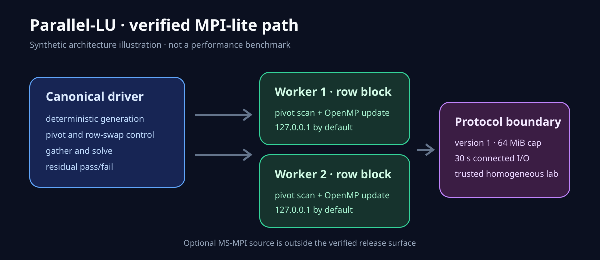

# Parallel-LU

[](https://github.com/AFR0011/Parallel-LU/actions/workflows/ci.yml)

An MSc Computer Engineering course project exploring dense LU/Gaussian
elimination with partial pivoting in C++17. The maintained path compares a local
serial baseline with a custom Windows TCP driver/worker implementation and uses
OpenMP for elimination within each process.



This is supporting systems coursework, not a production HPC library or secure
cluster service. It does not claim a universal speedup.

## Verified scope

The reproducible, CI-tested surface is:

- `lu_driver.cpp` — one canonical coordinator with explicit `--serial` and
  `--hosts` modes;
- `lu_worker.cpp` — block-row worker for the MPI-lite TCP path;
- `lu_common.cpp/.h` — deterministic matrix generation, distribution, solve,
  residual, and CLI helpers;
- `lu_net.h` — bounded Winsock2 message transport;
- `tests/` — synthetic numerical, argument, frame, serial, and two-worker
  loopback checks.

`lu_mpi.cpp` contains a separate MS-MPI implementation. It is **implemented but
unverified** in this release because neither the local verification environment
nor CI installs the separate MS-MPI SDK and runtime. It is excluded from the
default build. `archive/lu_driver1.cpp` is a superseded duplicate coordinator
retained only as project history.

## Computation model

Dense rows are generated deterministically from a seed and distributed in
contiguous blocks. At each elimination step, workers contribute a pivot
candidate, the driver coordinates any row exchange, and the pivot tail is sent
back for parallel local updates. The gathered in-place LU matrix is solved on the
driver and checked against a regenerated `A` and `b`.

```text
deterministic A, b
       |
       v
block-row distribution
       |
       v
pivot scan -> row exchange -> pivot-tail broadcast
       |
       v
OpenMP elimination on local rows
       |
       v
gather -> solve -> residual/non-finite verification
```

Supported matrix modes are `dd`, `weakdd`, `rand`, and `near_singular`.

## Requirements

- Windows 10 or later;
- Visual Studio 2022 or later with Desktop development with C++;
- CMake 3.20 or later;
- Python 3.12 or later for the integration test harness.

The reviewed local build used Visual Studio 2026, MSVC 19.51, Windows SDK
10.0.26100, and CMake's standard MSVC OpenMP flag. GitHub Actions independently
builds and tests on `windows-latest`.

## Build and test

From a PowerShell or Developer Command Prompt:

```powershell
cmake -S . -B build -A x64 -DBUILD_TESTING=ON
cmake --build build --config Release --parallel
ctest --test-dir build -C Release --output-on-failure
python scripts/publication_guard.py
```

Maintained targets compile with `/W4 /permissive- /WX`; warnings fail the build.
The test suite uses generated matrices and loopback processes only. It does not
publish a scaling benchmark.

## Serial run

```powershell
build\Release\lu_driver.exe 32 `
  --serial `
  --matrix rand `
  --threads 1 `
  --timing `
  --verify
```

`--verify` defaults to a relative-residual tolerance of `1e-10`. Override it
explicitly when an experiment has a justified numerical contract:

```powershell
build\Release\lu_driver.exe 64 --serial --matrix dd --verify --residual-tol 1e-9
```

Verification returns exit code 3 when the result is non-finite or exceeds the
tolerance. Invalid arguments return 2; runtime/protocol failures return 1.

## Two-worker loopback run

Start each worker in a separate terminal:

```powershell
build\Release\lu_worker.exe --listen 127.0.0.1:5001 --threads 1
build\Release\lu_worker.exe --listen 127.0.0.1:5002 --threads 1
```

Create an untracked `hosts-local.txt`:

```text
127.0.0.1:5001
127.0.0.1:5002
```

Run the distributed path:

```powershell
build\Release\lu_driver.exe 32 `
  --hosts hosts-local.txt `
  --matrix rand `
  --threads 1 `
  --timing `
  --verify
```

The integration test automates this flow, requires the serial and distributed
checksums to agree, and uses a deterministic random case that exercises
cross-worker row swaps.

## TCP trust boundary

The custom protocol is intended only for loopback or a **trusted, homogeneous
lab network**. The wire representation uses native C++ integer and IEEE-754
memory layouts, so every participant must use a compatible Windows build and
protocol version.

The maintained transport:

- defaults workers to `127.0.0.1`;
- limits each frame to 64 MiB before allocation;
- marks frames with protocol version 1;
- applies 30-second send/receive timeouts after connection;
- validates worker endpoints and run parameters.

It does not provide authentication, authorization, encryption, portable byte
order, connect-timeout control, worker-loss recovery, or Byzantine-peer safety.
Do not bind to a public interface or route this protocol over an untrusted
network. See [SECURITY.md](SECURITY.md).

## Limits and evidence

- Matrix dimension is limited to 8192 and requested threads to 256. Available
  memory and the per-frame limit can impose smaller practical distributed sizes.
- Dense storage/factorization remains quadratic in matrix storage and cubic in
  arithmetic work.
- Residual agreement is a useful correctness signal, not proof of numerical
  stability across all matrices.
- No LAPACK/Eigen oracle, multi-machine failure campaign, Linux/OpenMPI path, or
  context-complete performance study is included.
- Timing and CSV output are instrumentation for local experiments. Generated
  CSVs, binaries, objects, host files, and logs are ignored by Git.

The release evidence establishes deterministic functional agreement for small
synthetic serial and two-worker cases. It does not establish real cluster
scaling, broad portability, or production reliability.

## Optional MS-MPI source

With the MS-MPI SDK installed and discoverable by CMake, an experimental target
can be requested:

```powershell
cmake -S . -B build-msmpi -A x64 -DPARALLEL_LU_BUILD_MSMPI=ON
cmake --build build-msmpi --config Release --target lu_mpi
```

That command is documented as an opt-in build route, not as verified release
evidence. Running the program additionally requires the matching MS-MPI runtime.

## Provenance and license

This is Ali Farrokhnejad's original coursework/personal implementation, including
shared logic developed from an earlier personal `lu_final.cpp`; no external or
classroom starter code was incorporated. See [NOTICE.md](NOTICE.md).

The repository is licensed under the [MIT License](LICENSE).
